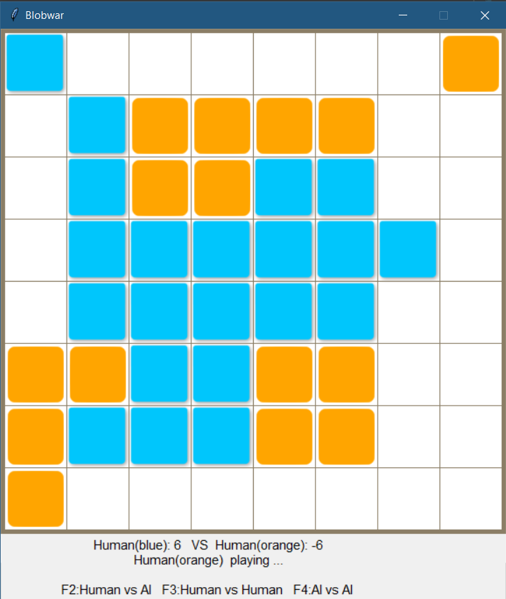

## Getting Started
___
In this project, we propose an implementation of the board game called [BlobWar](https://bpi-etu.pages.ensimag.fr/2-iterations/travaux-pratiques/travaux-pratiques/11-blobwars/index.html)
 proposed in the advanced algorithm course of [Grenoble-INP ENSIMAG Course](https://ensimag.grenoble-inp.fr/).  We have realized an Artificial Intelligence agent based on reinforcement learning to improve the performance of the computer in this game.
The board contains blue andorange pieces (also called blobs). Each player takes a turn. On each turn the current player chooses one of his pieces and moves it. Any piece may move to an adjacent empty square, including diagonally, duplicating itself and creating a new piece of the same color. A piece can also move two squares, i.e. max(dx,dy) = 2. In this case, there is no duplication and the pawn is said to make a "jump". Once arrived on its destination a pawn transforms all the neighboring pawns of its opponent into pawns of its own color. The game stops when both players cannot play or when the board is only occupied by one player. The player with the most pieces on the board wins the game.
As an example, the two pictures below illustrate a jump or the blue player from square (3,4) to square (5,4)
---


---
## Prerequisites
Install [Docker](https://github.com/davidADSP/SIMPLE/issues) and [Docker Compose](https://docs.docker.com/compose/install/) to make use of the `docker-compose.yml` file

## Installation
Depending on your operating system you will run .bat or .sh files in the following steps

1 Clone the repo
```sh
git clone https://github.com/Waguy02/DeepBlobWar.git
cd DeepBlobWar
```
2 Build the image and 'up' the container

Linux
   ``` sh 
   scripts/launch.sh  
   ```
Windows 
   ``` bat 
   scripts/launch.bat  
   ```


 


##Model
We made an implemented of our game model using the library **SIMPLE** of [https://github.com/davidADSP/SIMPLE](https://github.com/davidADSP/SIMPLE).
The model is based on [Proximal Policy Optimization(PPO)](https://openai.com/blog/openai-baselines-ppo/) algorithm from OpenAI which is the state of art in Reinforcement Learning Tasks especially in games.

The architecture of SIMPLE is the following
.
Look at  **[SIMPLE TUTORIAL](https://medium.com/applied-data-science/how-to-train-ai-agents-to-play-multiplayer-games-using-self-play-deep-reinforcement-learning-247d0b440717)** for more details on the 
implementation of SIMPLE


Our implementation has three many components:
* The game core : **`/app/environments/blobwar/core`**. In this package we completely define the game logic (Board, state management, action valuations,...)
* The BlobwarEnv:   **`/app/environments/blobwar/blobwar/envs`** . Here we realize a mapping between the game core and SIMPLE's Environment structure(based on OpenAI gym ).
* The Neural Model: **`/app/models/blobwar`**. Here we define the layers of the neural models components: (Policy Network, Value Network..). We used some convolutions 
layers to make the model learning relevant patterns in board configuration. 


##Training 
___
### Set the board size:
Go in the file `app/environments/blobwar/board_size` and set the value of __DEFAULT_SIZE . (from 5 to 10)


### Define the model layers:
Try to customize the model in the model architecture (Add or remove some layers). Pay attention on shapes and don't build a too deep model. Unless you have 100,000 CPUS.ahah


### Launch Training
Linux
  ```sh
   scripts/train_blobwar.sh
  ```
   Windows
  ```bash
     scripts/train_blobwar.bat
  ```
**Note**: The current script is configured to run the training in parallel way using 4 parallels processes. If you have more (respectfully less) cpus.
Just increase (respectfully descrease) this value. In the `scripts/train_blobwar.sh` or `scripts/train_blobwar.sh`.
___


<!-- TENSORBOARD -->
### Tensorboard

To monitor training, you can start Tensorboard with the following command:
  Linux
  ```sh
   scripts/tensorboard.sh
  ```
   Windows
  ```bash
     scripts/tensorboard.bat
  ```
Navigate to `localhost:6006` in a browser to view the output. You could see the learning curves described in **[SIMPLE TUTORIAL](https://medium.com/applied-data-science/how-to-train-ai-agents-to-play-multiplayer-games-using-self-play-deep-reinforcement-learning-247d0b440717)**
![Tensorboard][images/tensorboard]
For a board 6*6,the model start having intersting performance (beats Greedy model) after 200 iterations. I am currently running training and i will regurlaly update model 
performance. Also ,I am still working on the benckmarking part of the project.
In the `/app/zoo/blobwar` folder, `best_model.zip` is output each time the performance threshold is reached. Rename according to the size of board. (e.g if the size is 8*8, just rename it a `best_model.zip`) 


## GUI


We implemented a GUI using [game2board](https://github.com/mjbrusso/game2dboard]) to provide a nice and intuitive experience of the game; 
The game can be launched with differents various board size (from 5 to 10).

It is possible to play in the following configurations:
* Human vs AI
* Human vs Human
* AI vs AI


    
  It is possible to specify size of the board. The default size is specified by the variable "__DEFAULT_SIZE__" in file 
  **app/environments/blobward/board_size.py**
  
  For example, to launch a 8*8 board :  
  Linux
  ```sh
   scripts/run_gui.sh 8
  ```       
  Windows
  ```Bash
   scripts/run_gui.bat  8
  ```   
   Try to play some parties with against your friends or the AI. Have a fun!!

**Note**. The trained models should be the stored in the directory ** app/zoo/blobwar ** in the following format ** best_model[SIZE].zip **
(For example best_model6.zip and best_model8.zip for board 6*6 and 8*8 respectfully)

For a given size, if the model is not yet trained (ie best_model[SIZE].zip not exists), the AI player will use a greedy strategy which always try to 
maximize its next move (not very smart.)


<!-- CONTRIBUTING -->
## Contributing
Any contributions you make are **greatly appreciated**. Especially for the following tasks.
1. Implement classical algorithms like AlphaBeta, NegaMax, ...
2. Perform the benchmark of the best_model performance according those algorithms 


So: 
* Fork the Project
* Create your Feature Branch (`git checkout -b feature/AmazingFeature`)
* Commit your Changes (`git commit -m 'Add some AmazingFeature'`)
* Push to the Branch (`git push origin feature/AmazingFeature`)
* Open a Pull Request


---
<!-- CONTACT -->
## Contact
Guy Waffo - [@GDzuyo] -guywaffo@gmail.com


Project Link: [https://github.com/Waguy02/DeepBlobWar](https://github.com/Waguy02/DeepBlobWar)


---
<!-- ACKNOWLEDGEMENTS -->
## Acknowledgements
Thanks to David Foster [@davidADSP](https://twitter.com/davidADSP) who built this amazing framework and a quiet nice documentation. 
My main motivation was to apply recent reinforcement learning techniques to a new game so I considered popular games such as chess to
be unrelevant .


<!-- MARKDOWN LINKS & IMAGES -->
<!-- https://www.markdownguide.org/basic-syntax/#reference-style-links -->
[contributors-url]: https://github.com/Waguy02/DeepBlobWar/graphs/contributors
[forks-shield]: https://img.shields.io/github/forks/davidADSP/SIMPLE.svg?style=for-the-badge
[forks-url]: https://github.com/Waguy02/DeepBlobWar/network/members
[linkedin-url]: https://www.linkedin.com/in/guy-stephane-waffo-159030192/